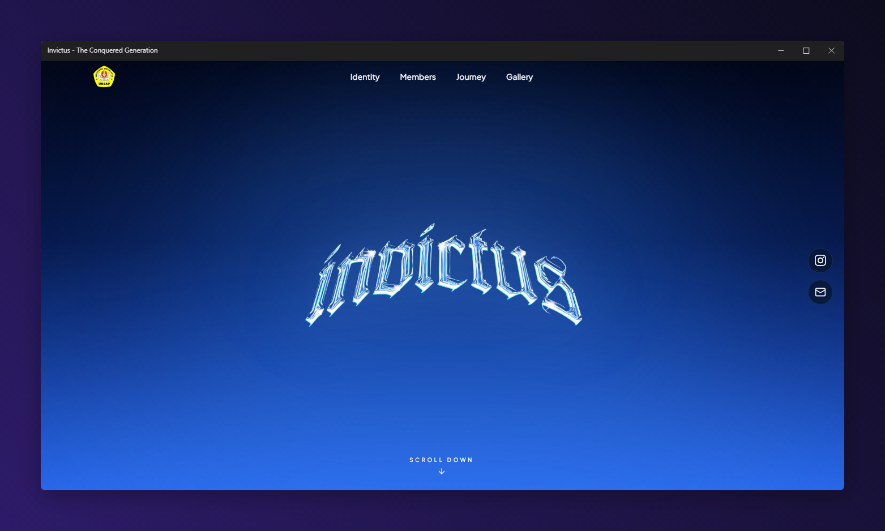

# INVICTUS

  

  A digital class archive for INVICTUS — Informatics 7C, Universitas Sebelas April.

---

## About

**INVICTUS** is a digital class archive created to preserve the people, memories, journey, and identity of the Invictus generation.

More than a class website, it is a digital monument built around the idea of:

> **One Class. One Story. One Legacy.**

The website combines an editorial yearbook aesthetic with a modern dark-blue visual identity, subtle motion, and immersive typography.

---

## Tech Stack

- **Next.js**
- **React**
- **TypeScript**
- **Tailwind CSS**
- **Framer Motion**
- **Lucide React**
- **Plus Jakarta Sans**

---

## Features

- Responsive design
- Animated page transitions and interactions
- Editorial-style member archive
- Class journey timeline
- Photo gallery
- Interactive Invictus Code manifesto
- Responsive navigation
- Optimized images with `next/image`
- SEO metadata and Open Graph support

---

  <strong>One Class. One Story. One Legacy.</strong>

---